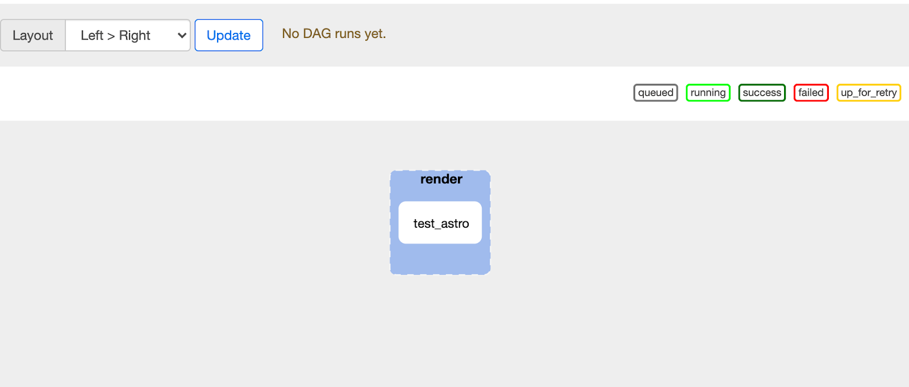
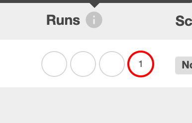
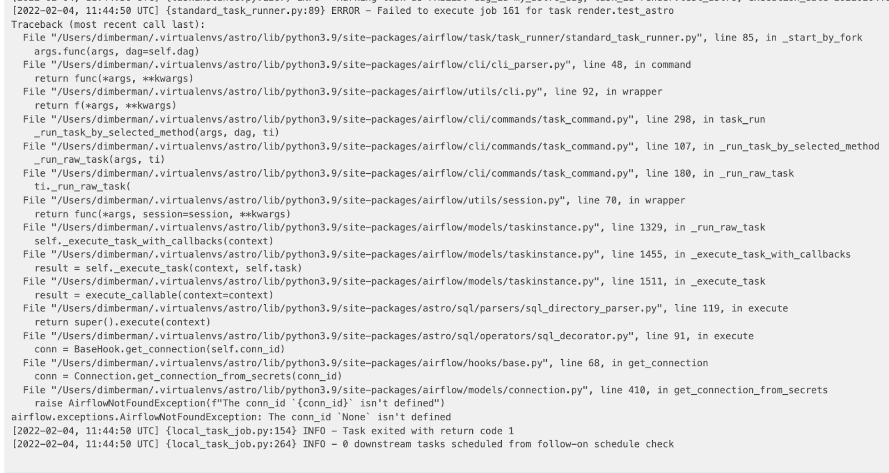
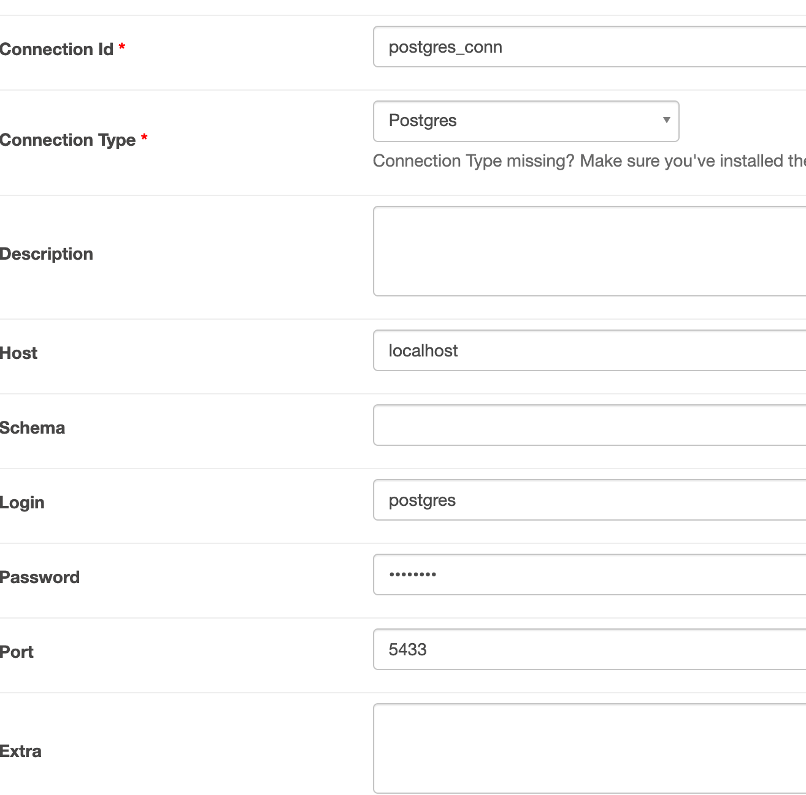
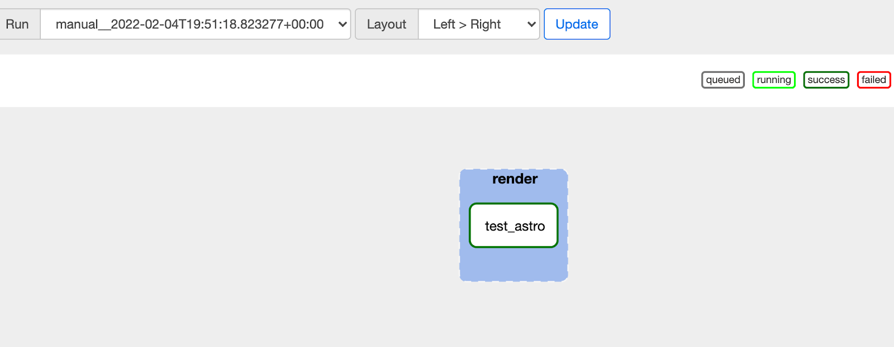
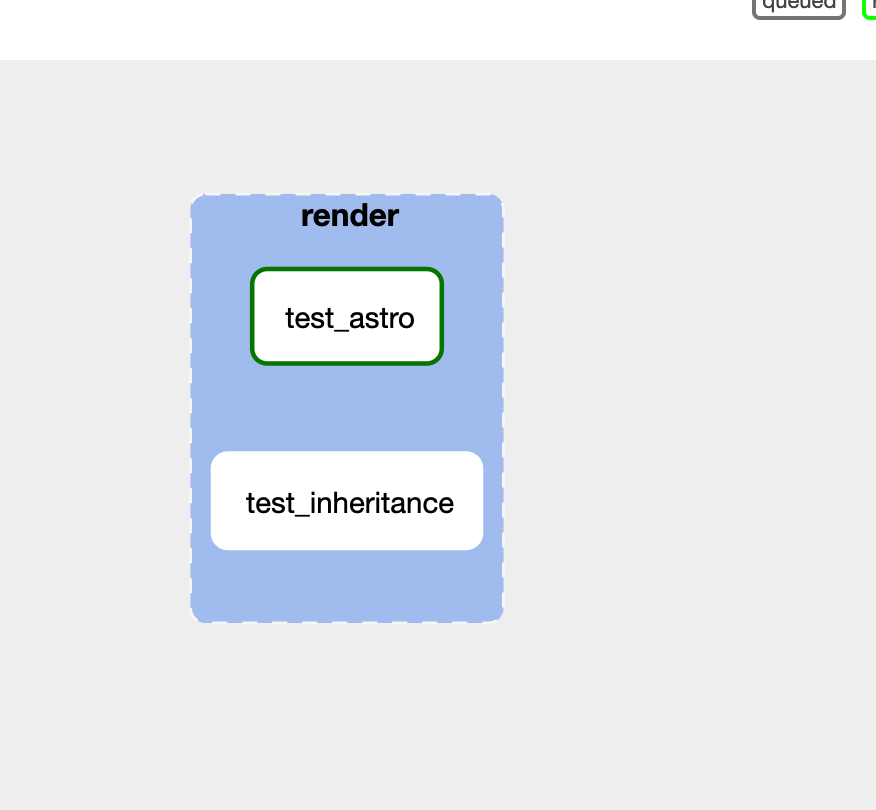
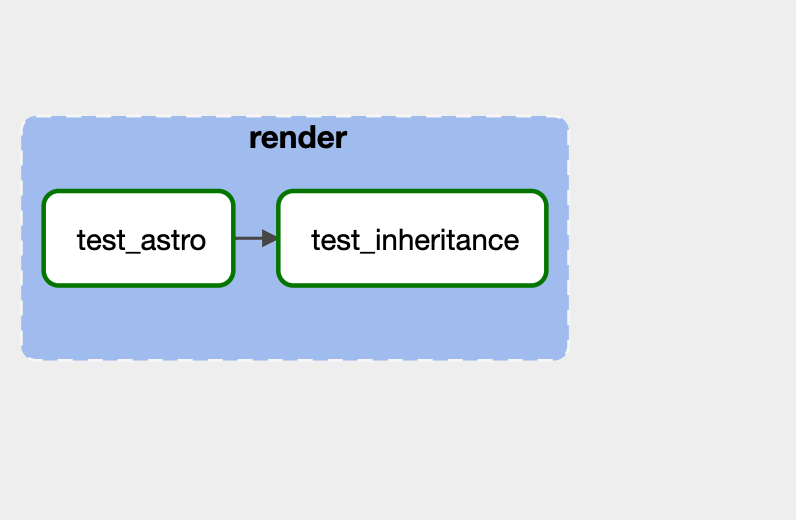

# Getting Started With Astro


## Downloading astro

Downloading astro is no different from installing any other python library. It requires Airflow 2.1+, and can be installed via pip either directly in the command line or in your requirements.txt file


### Option 1: pip install


```
pip install astro-projects
```


### Option 2: requirements.txt


```
astro-projects
```


## Setting Environment Variables

As fair as Airflow variables, the only airflow specific variable needed is to set xcom pickling to True. This will allow us to pass rich information between tasks that will improve your DAG writing experience.

To turn on xcom_pickling, you can set the following environment variable:


```
AIRFLOW__CORE__ENABLE_XCOM_PICKLING=True
```


### Alternative: set value in airflow.cfg


```
[core]
enable_xcom_pickling = true
```


## Setting a Temporary Schema

When processing SQL-based DAGs, Astro creates a lot of temporary tables. These tables allow SQL outputs to be inherited by other tasks and inspected for data quality. That said, we realize that creating a lot of temporary tables can lead to a situation where cleanup would be somewhat difficult. To address this concern, we store all temporary tables in a “temporary schema” that a DBA can delete in a single command. By default the name of the temporary schema is “tmp_astro”, but you can change this value to match the needs of your airflow application (e.g. a dev airflow could have a “tmp_astro_dev” schema).

To set your custom schema add the following environment variable:


```
AIRFLOW__ASTRO__SQL_SCHEMA="my_tmp_schema",
```


Note: \


Depending on your level of permissions you might need to speak with your dba about setting up a temporary schema for you ahead of time.


### Alternative: set value in airflow.cfg


```
[astro]
sql_schema="my_tmp_schema"
```


# Creating a test postgres instance

For the sake of this demo, let’s create a local postgres instance that is pre-populated with the [pagila](https://dataedo.com/samples/html/Pagila/doc/Pagila_10/home.html) dataset. This is a standard open dataset provided by postgres that has a number of movies, actors, and directors.

To set up pagila on your local machine, run the following docker command:


```shell script
docker run --rm -it -p 5433:5432 dimberman/pagila-test &
```


# Getting Up and Running


## Your First Astro DAG

Now that we have gotten all of the system-level work out of the way, let’s get started with our first DAG!

To begin your astro journey, please copy the following DAG into a python file in your DAG. You can name this file whatever you like, but we recommend you call it astro_dag.py


```python
import os
from datetime import datetime, timedelta

from airflow.models import DAG

from astro import sql as aql
from astro.sql.table import Table
from astro.dataframe import dataframe as adf
import pandas as pd

DAG_ID = "my_astro_dag"

default_args = {
    "retries": 1,
    "retry_delay": 0,
}

dag = DAG(
    dag_id=DAG_ID,
    start_date=datetime(2019, 1, 1),
    max_active_runs=3,
    schedule_interval=None,
    default_args=default_args,
)


@aql.transform
def test_astro():
    return "SELECT * FROM actor"


@aql.transform
def test_inheritance(my_astro_table: Table):
    return "SELECT * FROM {{my_astro_table}} LIMIT 10"


@adf
def my_dataframe_func(df: pd.DataFrame):
    print(df.to_string)


dir_path = os.path.dirname(os.path.realpath(__file__))
with dag:
    actor_table = test_astro(database="pagile", conn_id="my_postgres_conn")
    inherited_table = test_inheritance(my_astro_table=actor_table)
    my_dataframe_func(df=inherited_table)
```


Please note that you can set the DAG_ID variable to change the DAG ID in Airflow, but this is optional. Once you have pasted this code into your file, you’ll notice that Airflow can now find your DAG, but there are no tasks, so let’s make some!

### aql.transform
```python
@aql.transform
def test_inheritance(my_astro_table: Table):
    return "SELECT * FROM {{my_astro_table}} LIMIT 10"
```


## Creating your first SQL file-based DAG

```python
import os
from datetime import datetime, timedelta

from airflow.models import DAG

from astro import sql as aql

DAG_ID = "test_astro_dag"

default_args = {
    "retries": 1,
    "retry_delay": 0,
}

dag = DAG(
    dag_id=DAG_ID,
    start_date=datetime(2019, 1, 1),
    max_active_runs=3,
    schedule_interval=None,
    default_args=default_args,
)


dir_path = os.path.dirname(os.path.realpath(__file__))
with dag:
    models = aql.render(dir_path + "/models")
```

### Understanding astro.render

Before you make your first SQL task, let’s take a look at what the `astro.render` function is doing.


```python
dir_path = os.path.dirname(os.path.realpath(__file__))
with dag:
    models = aql.render(dir_path + "/models")
```


What is happening here is that `aql.render` allows a user to pass in a directory and then parses that directory as a whole (we’ll get into more detail on that later). When we pass in the argument `dir_path + “/models”`, we are telling astro to look for a file that is “current directory + “/models”. In reality, this directory could live anywhere on your machine! We figured that a local path would be the easiest for project management.


### Now the fun part

So now that you understand a bit more about how astro finds directories for SQL file processing, let’s create the `models` directory to match the code in our DAG.

Once you’ve created the models directory let’s create a file called `test_astro.sql`.


```Your project
├── dags
│   ├── astro_dag.py
│   ├── models
│   │   ├── test_astro.sql
```


For this file, we can put in a simple query that hits the pagila database


test_astro.sql
```
SELECT * FROM actor
```


Now let’s head over to our Airflow instance and we will see that there is now a dag with a single task tied to the `test_astro.sql` file.





And we’re up and running! Let’s unpause this DAG, hit the play button, and…





Oh.

Well it looks like there is a bit more work before we can start writing SQL DAGs.

Looking at the logs, we see this error:





So the reason our SQL isn’t running is because we never actually told it where to run. Let’s fix that.

The first step to connecting our SQL to a postgres instance is to create a connection. Assuming you ran the docker command we provided, your postgres should live at localhost:5433. Here is an example of what that could look like in the UI





Or you can copy this command-line command into your terminal, and it will set up the connection on your local airflow.


```
airflow connections add 'postgres_conn_2' \
    --conn-type 'postgresql' \
    --conn-login 'postgres' \
    --conn-password 'postgres' \
    --conn-host 'localhost' \
    --conn-port '5433'
```


Now that you’ve created your postgres connection, we need a way to tell airflow that you want to use that connection (and database) for this query. To do this, we take advantage of a common webpractice of creating a [frontmatter](https://jekyllrb.com/docs/front-matter/). Frontmatters allow us to store all metadata for your SQL in a place where it won’t make your SQL hard to read. In this first example we are setting the conn_id, and database, but there are other options that we will show later on.

With the frontmatter set your `astro_test.sql` file should now look like this:


```
---
conn_id: postgres_conn
database: pagila
---
SELECT * FROM actor;
```


We give airflow a few seconds to parse the file, run it again, and…





Success!

So now we have a single passing SQL query running in Airflow, let’s make the second task!


## Adding the Second Task

To add a second task, let’s make a second SQL file named `test_inheritance.sql` in the `models` directory. Your project should now look like this:


```
Your project
├── dags
│   ├── astro_dag.py
│   ├── models
│   │   ├── test_astro.sql
│   │   ├── test_inheritance.sql
```


To start out, we’ll just put a simple SQL statement into this file

test_inheritance.sql


```
SELECT * FROM test_astro;
```


When we go back to Airflow, we will see the second task created, but these tasks don’t have any dependencies, so they would both act in parallel (and `test_inheritance` would fail as there’s no connection id or table named `test_astro`).



To set the proper inheritance, we set a jinja template ``{{}}`` around `test_astro` to alert airflow that this is actually referring
to a task instead of a table in the database.


```
SELECT * FROM {{test_astro}};
```


This results in the following:




And it works!

But how is that possible if you didn’t set the `conn_id` or `database` variables? Well that’s because we were able to automatically inherit the context of the parent tasks. This inheritance prevents a lot of unnecessary repetitions and should make changing databases much easier if you decide to do so.


## Tying SQL Results to Dataframes

Finally let’s tie the results of our SQL models into a dataframe so we can complete our processing in a pythonic context.

To add this step, copy the bolded lines into your DAG file:


```
import os
from datetime import datetime, timedelta

from airflow.models import DAG

from astro import sql as aql
from astro.dataframe import dataframe as adf
import pandas as pd

DAG_ID = "my_astro_dag"

default_args = {
   "retries": 1,
   "retry_delay": 0,
}

dag = DAG(
   dag_id=DAG_ID,
   start_date=datetime(2019, 1, 1),
   max_active_runs=3,
   schedule_interval=None,
   default_args=default_args,
)


@adf
def my_dataframe_func(df: pd.DataFrame):
   print(df.to_string)


dir_path = os.path.dirname(os.path.realpath(__file__))
with dag:
   models = aql.render(dir_path + "/models")
   my_dataframe_func(df=models["test_inheritance"])
```


The first thing you’ll notice here is that we can treat the results of our model rendering as a python dictionary. You can access each model we have defined via that dictionary. You may also notice that you can pass a SQL table into a python function and have that table surface as a dataframe with no extra configuration. That is because we handle all of that complexity for you!

Even in cases where there are multiple tables from multiple SQL sources, Astro can parse and load those tables into local dataframes for any number of machine learning or data processing use-cases.
