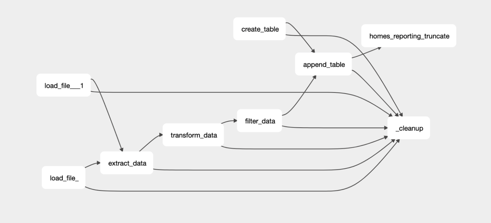

# AEP-2 Automatic Temporary Table cleanup


Authors:
* Daniel Imberman (daniel@astronomer.io)


## Status

| <!-- -->       |  <!-- -->                                                 |
| -------------- | --------------------------------------------------------- |
| **State**      | Accepted  |
| **Discussion** | https://github.com/astronomer/astro-sdk/issues/436                                      |
| **Created**    | 2022-06-05                                                |


## Motivation

When running `aql.transform` or `aql.load_file` jobs, the Astro SDK implicitly creates temporary tables in the database every time the DAG runs. These extra tables are currently handled by placing all tables into a “temporary schema”. The thought behind these schemas is that a DBA can easily delete the schema if it starts to get full. This answer is insufficient so a better solution for table cleanup should be enacted.

Temporary schemas are unfortunately an unideal solution to this problem. Users would need to define the same named schema across all of their databases, and there’s no guarantee that a user would even have access to more than one schema in a certain database (e.g. if you only have write access to a sandbox in your snowflake instance, you wouldn’t want to necessarily delete your sandbox.
## Proposal

Let’s offer a more “surgical” approach to deleting temporary tables. One that can work in any schema across any number of databases. This approach would ensure that at the end of a DAG run, Airflow would delete all tables created by that DAG run.

The interface would be a task called `aql.cleanup`. This task would by default wait until the DAG is complete before deleting all tables, though a user can decide to set it downstream to a set of tasks if they only want those temporary tables deleted.

* What change do you propose to make?
* Propose the interface here.
* Other considerations?
* What is the scope of this AEP?
* What defines this AEP as "done"?


## Assumptions and Limitations

### Option 1: A custom DAG object

Similar to how the marquez project handled Airflow pre 2.0, we can offer our own custom DAG object. This would allow us to supply our own custom callbacks transparent to the user
```python
from astro.dag import DAG

dag = DAG(
    dag_id="example_amazon_s3_postgres",
    start_date=datetime(2019, 1, 1),
    max_active_runs=3,
    schedule_interval=timedelta(minutes=30),
    default_args=default_args,
)


with dag:
    my_homes_table = aql.load_file(
        input_file=File(path=f"{s3_bucket}/homes.csv"),
        output_table=Table(
            conn_id="postgres_conn",
        ),
    )
    sample_table = sample_create_table(my_homes_table)
    my_df_func(sample_table)
```

Pros:
* By far the least work for the user
* Only requires an import
* Agnostic to DAG structure

Cons:
* Users would need to use custom DAG objects which might(?) be a concern?
* Callback logs are not easily viewable to users

### Option 2: create a custom callback

If we want to keep things less “magical” while still supplying an easy solution for users that is low effort we can also just explicitly supply a custom callback function. This function would be places in the on_success_callback and on_failure_callback objects.

```python
from astro.sql.callbacks import clear_temp_table_callback

dag = DAG(
    dag_id="example_amazon_s3_postgres",
    start_date=datetime(2019, 1, 1),
    max_active_runs=3,
    schedule_interval=timedelta(minutes=30),
    default_args=default_args,
    on_success_callback=clear_temp_table_callback,
    on_failure_callback=clear_temp_table_callback,
)


with dag:
    my_homes_table = aql.load_file(
        input_file=File(path=f"{s3_bucket}/homes.csv"),
        output_table=Table(
            conn_id="postgres_conn",
        ),
    )
    sample_table = sample_create_table(my_homes_table)
    my_df_func(sample_table)
```

Pros:
* Agnostic to DAG shape
* More transparent than DAG object

Cons:
* Users can no longer supply their own on_success or on_failure callbacks
* Requires some airflow knowledge (knowing that these callbacks exist)
* Callback logs are not easily viewable to users

### Option 3: a function with a table parameter

If we want FULL user transparency, we could offer a “cleanup” function that creates a task. It’s worth noting that as a task, there’s no implicit way to place this function at the end of the DAG, therefore we would ask users supply the tasks as function parameters s.t. We can clean the tasks at the end

```python
with dag:
    my_homes_table = aql.load_file(
        input_file=File(path=f"{s3_bucket}/homes.csv"),
        output_table=Table(
            conn_id="postgres_conn",
        ),
    )
    sample_table = sample_create_table(my_homes_table)
    df_res = my_df_func(sample_table)
    aql.cleanup(tables_to_cleanup=[my_homes_table, sample_table, df_res])
```
Pros:
* Requires no airflow knowledge
* Users can control when the temp tables are deleted. They can delete it after the end of a task(s) or at the end of DAG.
* Easy to debug, as tasks logs are accessible from the webserver as opposed to callbacks
* Allows using tasks trigger rules which gives control of running cleanup even when certain task fails

Cons:
* If users add new tasks to the DAG, they need to remember to add it to the list
* It might find all tables and delete them before they necessarily SHOULD be deleted if the downstream tasks are not added to the dependencies list

### Option 4: a function with no parameters

```python
with dag:
    my_homes_table = aql.load_file(
        input_file=File(path=f"{s3_bucket}/homes.csv"),
        output_table=Table(
            conn_id="postgres_conn",
        ),
    )
    sample_table = sample_create_table(my_homes_table)
    df_res = my_df_func(sample_table)
    [my_homes_table, sample_table, df_res] >> aql.cleanup()
```

Pros:
* Would automatically find all tables
* Easy to debug, as tasks logs are accessible from the webserver as opposed to callbacks
* Allows using tasks trigger rules which gives control of running cleanup even when certain task fails

Cons:
* This ruins the feeling of the astro python SDK seeming “new”. We are exiting the functional paradigm and are now back in the land of bitshifting tasks.
* If users add new tasks to the DAG, they need to remember to add it to the list
* It might find all tables and delete them before they necessarily SHOULD be deleted if the downstream tasks are not added to the dependencies list

### Option 5: A listener

We looked into using the new airflow listener feature for this feature, but unfortunately found it was not compatible. Even if it was, it would require
asking users to install a custom plugin to their airflow instance which would add startup overhead.

### Option 6: An asynchronous task

One major issue with all task-based ideas is that we end up in a situation where the DAG becomes much harder to read (as there is a final task that is downstream of all tasks. This can create a lot of clutter

Where a DAG before might look like this:


The addition of the extra step adds a lot of complexity to the DAG shape:



Ideally we would like to have the transparency of a task, but without the extra logic or DAG structure complexity.

We believe that we can accomplish this using an asynchronous operator.

Using an asynchronous operator, we can create a task that does not NEED to run downstream of every other task. Instead this task can run in parallel, and only actually perform cleanups once every other task in the DAG has been accounted for (either passing, failing, or being skipped).


This structure will allow the DAG structure to remain relatively unchanged, keep additional code to a minimum for the DAG author AND allow users the ability to control if they only want certain tables deleted (e.g. if you give it a list of tasks it will only delete for those tasks, otherwise it will wait for all tasks to complete).
