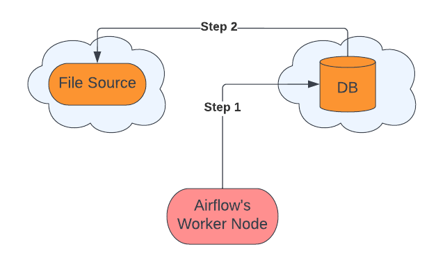

======================================
load_file operator
======================================

When to Use load_file operator
~~~~~~~~~~~~~~~~~~~~~~~~~~~~~~~~~~~~~~

There are two use cases of the load_file operator.

#. When we want a file to be loaded into a database table
#. When we want a file to be converted to dataframe

Case 1: Load into a database table
    you need to pass the `output_table` param to the load_file operator to convert it to a table and the operator returns an instance of the table object passed in `output_table`. The output table will be created if it doesn't exist and will be replaced if it does. We can change this behavior with the `if_exists` parameter.

    .. literalinclude:: ../../../../example_dags/example_load_file.py
       :language: python
       :start-after: [load_file_example_1_start]
       :end-before: [load_file_example_1_end]

Case 2: Load into pandas dataframe
    If you don't pass the `output_table` to the load_file operator it converts the file into a pandas dataframe and returns the reference to dataframe.

    .. literalinclude:: ../../../../example_dags/example_load_file.py
       :language: python
       :start-after: [load_file_example_2_start]
       :end-before: [load_file_example_2_end]

Parameters to use when loading a file to the database table
~~~~~~~~~~~~~~~~~~~~~~~~~~~~~~~~~~~~~~~~~~~~~~~~~~~~~~~~
#. **ndjson_normalize_sep** - This parameter is useful when the input file type is NDJSON. Since NDJSON file can be multidimensional, we normalize the data to two-dimensional data, so that it is suitable to be loaded into a table and this parameter is used as a delimiter for combining columns names if required.
    example:
        input JSON:

        .. code:: python

           {"a": {"b": "c"}}

        output table:

        .. list-table::
           :widths: auto

           * - a_b
           * - c

    Note - columns a and b are merged to form one col a_b and `_` is used as a delimiter.

    .. literalinclude:: ../../../../example_dags/example_load_file.py
       :language: python
       :start-after: [load_file_example_3_start]
       :end-before: [load_file_example_3_end]

#. **if_exists** - This parameter comes in handy when the table you trying to create already exists. In such a case, we have two options, either replace or append. Which can we accomplish by passing ``if_exists='append'`` or ``if_exists='replace'``.

    .. literalinclude:: ../../../../example_dags/example_load_file.py
       :language: python
       :start-after: [load_file_example_4_start]
       :end-before: [load_file_example_4_end]

#. **output_table** - We can specify the output table to be created by passing in this parameter, which is expected to be an instance of ``astro.sql.table.Table``. Users can specify the schema of tables by passing in the ``columns`` parameter of ``astro.sql.table.Table`` object, which is expected to be a list of the instance of ``sqlalchemy.Column``. If the user doesn't specify the schema the schema is inferred using pandas.

    .. literalinclude:: ../../../../example_dags/example_load_file.py
       :language: python
       :start-after: [load_file_example_5_start]
       :end-before: [load_file_example_5_end]

Parameters to use when loading a file to pandas dataframe
~~~~~~~~~~~~~~~~~~~~~~~~~~~~~~~~~~~~~~~~~~~~~~~~~~~~~~~~~~
#. ``columns_names_capitalization`` Control col names case of the dataframe generated from the file. The default value is ``original``.
        *  **original** - Remains the same as the input file
        *  **upper** - Convert to uppercase
        *  **lower** - Convert to lowercase

    .. literalinclude:: ../../../../example_dags/example_load_file.py
       :language: python
       :start-after: [load_file_example_6_start]
       :end-before: [load_file_example_6_end]

How load_file Works
~~~~~~~~~~~~~~~~~~~~~~~~~~~~~~~~~~~~~~~~~~~~~~~~~~~~
.. figure:: ../../../images/defaultPath.png

When we load a file located in cloud storage to a cloud database, internally the steps involved are:

Steps:

#. Get the file data in chunks from file storage to the worker node.
#. Send data to the cloud database from the worker node.

This is the default way of loading data into a table. There are performance bottlenecks because of limitations of memory, processing power, and internet bandwidth of worker node.

Improving bottlenecks by using native paths
~~~~~~~~~~~~~~~~~~~~~~~~~~~~~~~~~~~~~~~~~~~~~~~~~~~~~~

Some of the cloud databases like Bigquery and Snowflake support native paths (complete list of supported native paths :ref:`supported_native_path`) to ingest data from cloud storage directly. Using this we can ingest data much quicker and without any involvement of the worker node.

Steps:

#. Request destination database to ingest data from the file source.
#. Database request file source for data.

This is a faster way to ingest data as there is only one network call involved and usually the bandwidth between vendors is high. Also, there is no requirement for memory/processing power of the worker node, since data never gets on the node. There is significant performance improvement due to native paths as evident from benchmarking results.

**Note** - By default the native path is enabled and will be used if the source and destination support it, this behavior can be altered by the ``use_native_support`` param.

Parameters for native path
~~~~~~~~~~~~~~~~~~~~~~~~~~~~~~~~~~~~~~~~~~~~~~~~~~~~~~~~

#. **use_native_support** - Native paths support is available for some FileSource and Databases, if it is available the default is to use this path. To leverage these paths certain settings/changes need to be done on destination databases. If for some reason users don't want to use these paths they can turn off this behavior by passing ``use_native_support=False``.
        This feature is enabled by default, to disable it refer to below code.

        .. literalinclude:: ../../../../example_dags/example_load_file.py
           :language: python
           :start-after: [load_file_example_7_start]
           :end-before: [load_file_example_7_end]

        To check if the native path will be used for data transfer for a combination of file location and database, refer section :ref:`supported_native_path`

#. **native_support_kwargs** - Since we support multiple databases they may require some parameters to process a file or control error rate etc, those parameters can be passed in ``native_support_kwargs``. These parameters are passed to the destination database.

        Check for valid parameters based on **file location** and **database** combination in section :ref:`supported_native_path`

        .. literalinclude:: ../../../../example_dags/example_load_file.py
           :language: python
           :start-after: [load_file_example_8_start]
           :end-before: [load_file_example_8_end]

#. **enable_native_fallback** -  When ``use_native_support`` is True, we try to use the native path, and if this fails we try to use the default path to load data, giving the user a warning. If you want to change this behavior pass ``enable_native_fallback=False``.

        .. literalinclude:: ../../../../example_dags/example_load_file.py
           :language: python
           :start-after: [load_file_example_9_start]
           :end-before: [load_file_example_9_end]

.. _supported_native_path:

Supported Native Paths
~~~~~~~~~~~~~~~~~~~~~~~~~~~~~~~~~~~~~~~~~~~~~~~~~~~~~~~~
.. list-table::
   :widths: auto

   * - File Location
     - Database
     - native_support_kwargs params
   * - S3
     - Bigquery
     - https://cloud.google.com/bigquery-transfer/docs/s3-transfer#bq
   * - GCS
     - Bigquery
     - https://cloud.google.com/bigquery-transfer/docs/cloud-storage-transfer#bq
   * - S3
     - Snowflake
     -
   * - GCS
     - Snowflake
     -
