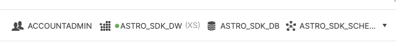
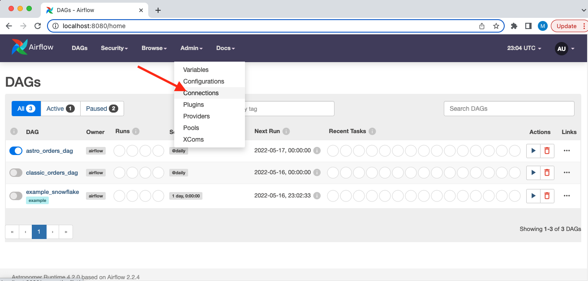
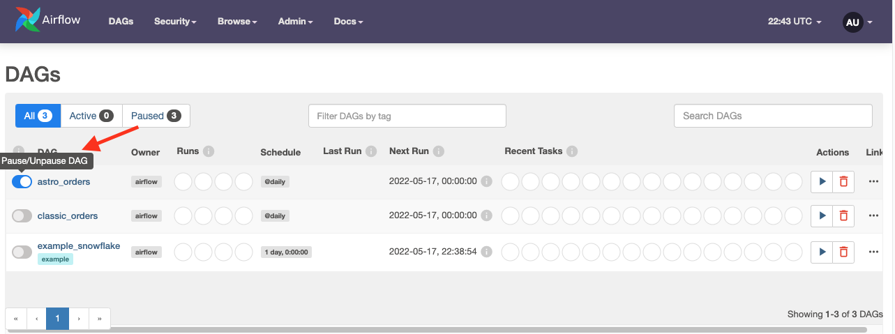
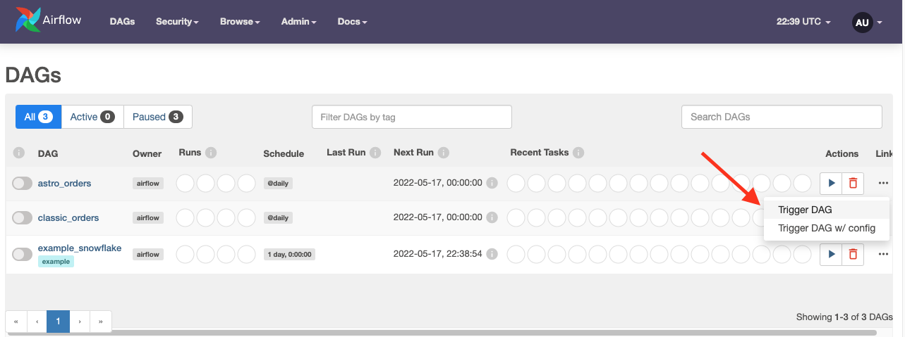
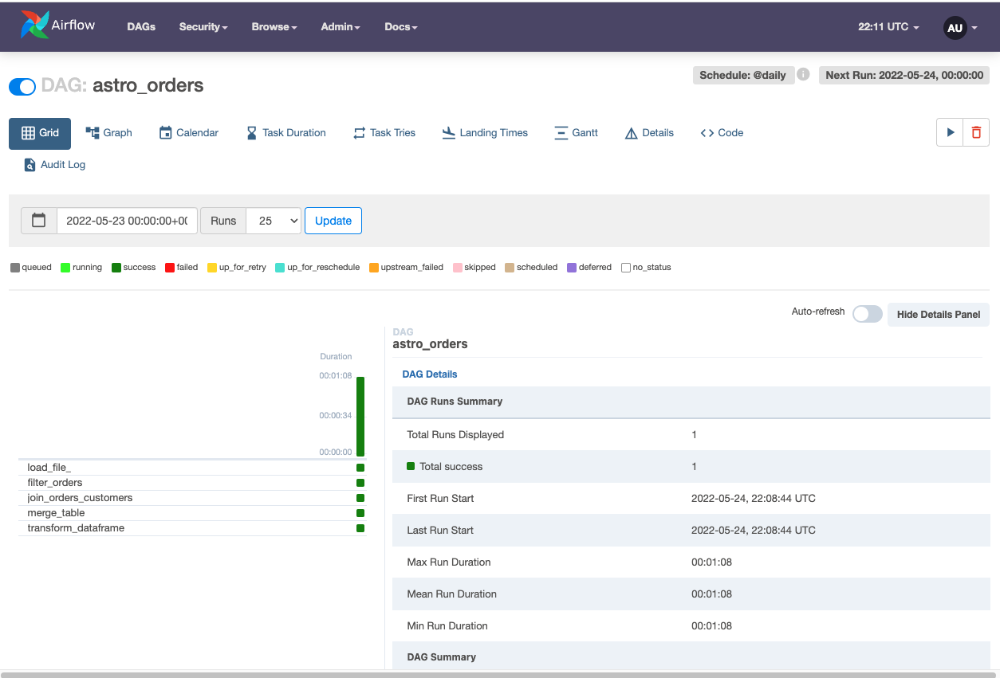
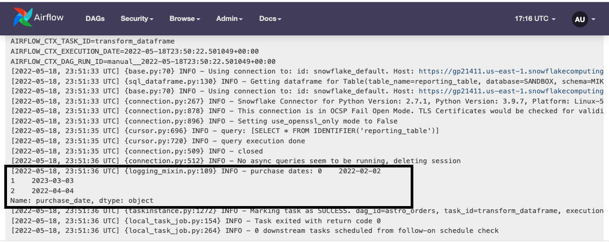

<h1 align="center">
  Astro Python SDK
</h1>
  <h3 align="center">
  Tutorial<br><br>
</h3>

# Introduction

This tutorial demonstrates how to use the Astro Python SDK through a simple ETL example that you can run on your local machine:
* **Extract** a file from S3 into a Snowflake relational table
* **Transform** that table in Snowflake
* **Load** that transformed table into a reporting table in Snowflake

You'll need to use existing Amazon S3 and Snowflake accounts, or create some trial versions.

***
# Let's do some setup

## Install Airflow

* Install Python and `virtualenv` (ignore if already installed).

  For macOS, you can follow these steps:
    * Install homebrew:

      ```shell
      /bin/bash -c "$(curl -fsSL https://raw.githubusercontent.com/Homebrew/install/HEAD/install.sh)"
      ```
    * `brew install python`
    * `brew install pip`
    * `pip install virtualenv `

* Create a new virtual environment by running:

  ```shell
  python3 -m virtualenv env
  ```

* Activate environment ``source env/bin/activate``
* [Install Airflow](https://airflow.apache.org/docs/apache-airflow/stable/start/local.html)

## Set up your data stores

### Set up S3

[Setup](https://docs.aws.amazon.com/AmazonS3/latest/userguide/GetStartedWithS3.html) an S3 account and storage bucket.

Upload this datafile from your local machine to your newly created aws bucket

```
order_id,customer_id,purchase_date,amount
ORDER1,CUST1,1/1/2021,100
ORDER2,CUST2,2/2/2022,200
ORDER3,CUST3,3/3/2023,300
```

### Set up Snowflake

Sign up for a [free Snowflake trial](https://signup.snowflake.com/), selecting the Enterprise Edition.

Once your workspace is ready, navigate to a worksheet and enter these commands:

```sql
create warehouse ASTRO_SDK_DW;
create database ASTRO_SDK_DB;
create schema ASTRO_SDK_SCHEMA;
```
Then, in the classic Snowflake console in the upper right, select the role, warehouse, database and schema
to look like this:



Note that you can set the warehouse, database, and schema names to something else, but you'll just
need to be consistent with whatever names you choose throughout the remainder of this tutorial.

## Install Astro-SDK on your local machine

* Run the following command to install the Python SDK, with the extra packages necessary to access AWS and Snowflake.


  ```shell
  pip install 'astro-sdk-python[amazon,snowflake]>=0.11'
  ```

* Create the following environment variables

  ```shell
  export AIRFLOW__CORE__ENABLE_XCOM_PICKLING=True
  export AIRFLOW__ASTRO_SDK__SQL_SCHEMA=<snowflake_schema>
  ```

If you're using macOS, set this environment variable too [(background)](https://github.com/apache/airflow/issues/12808):

  ```shell
  export OBJC_DISABLE_INITIALIZE_FORK_SAFETY=YES
  ```

* Start Airflow by running `airflow standalone` command and check out the Webserver
at [`http://localhost:8080/`](http://localhost:8080/).

## Setup Airflow connections

* In your Astronomer Airflow UI select Admin-->Connectors




### Connect S3 to Airflow

Click on the blue "+" icon to *Add a new record*

Set these fields:

* Connection Id: `aws_default`
* Connection Type: `S3`
* Extra: `{"aws_access_key_id": "<your_access_key>", "aws_secret_access_key": "<you_secret_access_key>"}`

### Connect Snowflake to Airflow

Click on the blue "+" icon to *Add a new record*

* Connection Id: `snowflake_default`
* Connection Type: `Snowflake`
* Host: `https://<account>.<region>.snowflakecomputing.com/`. This is the URL where you can log into your Snowflake account
* Schema: `ASTRO_SDK_SCHEMA`
* Login:
* Password:
* Account:
* Database: `ASTRO_SDK_DB`
* Region: (something like `us-east-1` or `us-central1.gcp`)
* Role: `ACCOUNTADMIN`
* Warehouse: `ASTRO_SDK_DW`


***
# Create and populate some tables in Snowflake

We'll create some auxiliary tables in Snowflake and populate with a small amount of data for our ETL example.

* Create and populate a customer table to join with an orders table that we create with the Astro Python SDK:

```sql

CREATE OR REPLACE TABLE customers_table (customer_id CHAR(10), customer_name VARCHAR(100), type VARCHAR(10) );

INSERT INTO customers_table (CUSTOMER_ID, CUSTOMER_NAME,TYPE) VALUES ('CUST1','NAME1','TYPE1'),('CUST2','NAME2','TYPE1'),('CUST3','NAME3','TYPE2');
```

* Create and populate a reporting table into which we'll merge our transformed data:

```sql

CREATE OR REPLACE TABLE reporting_table (
    CUSTOMER_ID CHAR(30), CUSTOMER_NAME VARCHAR(100), ORDER_ID CHAR(10), PURCHASE_DATE DATE, AMOUNT FLOAT, TYPE CHAR(10));

INSERT INTO reporting_table (CUSTOMER_ID, CUSTOMER_NAME, ORDER_ID, PURCHASE_DATE, AMOUNT, TYPE) VALUES
('INCORRECT_CUSTOMER_ID','INCORRECT_CUSTOMER_NAME','ORDER2','2/2/2022',200,'TYPE1'),
('CUST3','NAME3','ORDER3','3/3/2023',300,'TYPE2'),
('CUST4','NAME4','ORDER4','4/4/2022',400,'TYPE2');
```
***
# Simple ETL workflow

Use your favorite code editor or text editor to copy-paste the following code into a *.py file in <your-project>/dags/ directory.

Here's the code for the simple ETL workflow:

```python
from datetime import datetime

from airflow.models import DAG
from pandas import DataFrame

from astro import sql as aql
from astro.files import File
from astro.sql.table import Table

S3_FILE_PATH = "s3://<aws-bucket-name>"
S3_CONN_ID = "aws_default"
SNOWFLAKE_CONN_ID = "snowflake_default"
SNOWFLAKE_ORDERS = "orders_table"
SNOWFLAKE_FILTERED_ORDERS = "filtered_table"
SNOWFLAKE_JOINED = "joined_table"
SNOWFLAKE_CUSTOMERS = "customers_table"
SNOWFLAKE_REPORTING = "reporting_table"


@aql.transform
def filter_orders(input_table: Table):
    return "SELECT * FROM {{input_table}} WHERE amount > 150"


@aql.transform
def join_orders_customers(filtered_orders_table: Table, customers_table: Table):
    return """SELECT c.customer_id, customer_name, order_id, purchase_date, amount, type
    FROM {{filtered_orders_table}} f JOIN {{customers_table}} c
    ON f.customer_id = c.customer_id"""


@aql.dataframe
def transform_dataframe(df: DataFrame):
    purchase_dates = df.loc[:, "purchase_date"]
    print("purchase dates:", purchase_dates)
    return purchase_dates


dag = DAG(
    dag_id="astro_orders",
    start_date=datetime(2019, 1, 1),
    schedule_interval="@daily",
    catchup=False,
)

with dag:
    # Extract a file with a header from S3 into a temporary Table, referenced by the
    # variable `orders_data`
    orders_data = aql.load_file(
        # data file needs to have a header row
        input_file=File(
            path=S3_FILE_PATH + "/orders_data_header.csv", conn_id=S3_CONN_ID
        ),
        output_table=Table(conn_id=SNOWFLAKE_CONN_ID),
    )

    # Create a Table object for customer data in our Snowflake database
    customers_table = Table(
        name=SNOWFLAKE_CUSTOMERS,
        conn_id=SNOWFLAKE_CONN_ID,
    )

    # Filter the orders data and then join with the customer table,
    # saving the output into a temporary table referenced by the Table instance `joined_data`
    joined_data = join_orders_customers(filter_orders(orders_data), customers_table)

    # Merge the joined data into our reporting table, based on the order_id .
    # If there's a conflict in the customer_id or customer_name then use the ones from
    # the joined data
    reporting_table = aql.merge(
        target_table=Table(
            name=SNOWFLAKE_REPORTING,
            conn_id=SNOWFLAKE_CONN_ID,
        ),
        source_table=joined_data,
        target_conflict_columns=["order_id"],
        columns=["customer_id", "customer_name"],
        if_conflicts="update",
    )

    purchase_dates = transform_dataframe(reporting_table)

    # Delete temporary and unnamed tables created by `load_file` and `transform`, in this example
    # both `orders_data` and `joined_data`
    aql.cleanup()
```
***
# Run it!

In your Airflow UI's home page, you should see a DAG called astro_orders. Toggle the DAG to unpause it:



Then, trigger it to run it:



Click on the astro_orders DAG name to see the grid view of its execution:


***
# Walk through the code

## Extract

To extract from S3 into a SQL Table, we need only specify the location on S3 of the data and a connection for Snowflake that the Python SDK can use for internal purposes:

```python
# Extract a file with a header from S3 into a temporary Table, referenced by the
# variable `orders_data`
orders_data = aql.load_file(
    # data file needs to have a header row
    input_file=File(path=S3_FILE_PATH + "/orders_data_header.csv", conn_id=S3_CONN_ID),
    output_table=Table(conn_id=SNOWFLAKE_CONN_ID),
)
```

In this example, we do not want to persist the content of `orders_data` after the DAG is completed.
When we create a `Table` object without a name, that table is considered a temporary table.
The Astro SDK will delete all temporary tables if the user adds the task `aql.cleanup` to the DAG.

## Transform

We can execute a filter and join in a single line of code to fill in a value for `joined_data`:

```python
@aql.transform
def filter_orders(input_table: Table):
    return "SELECT * FROM {{input_table}} WHERE amount > 150"


@aql.transform
def join_orders_customers(filtered_orders_table: Table, customers_table: Table):
    return """SELECT c.customer_id, customer_name, order_id, purchase_date, amount, type
    FROM {{filtered_orders_table}} f JOIN {{customers_table}} c
    ON f.customer_id = c.customer_id"""


# Create a Table object for customer data in our Snowflake database
customers_table = Table(
    name=SNOWFLAKE_CUSTOMERS,
    conn_id=SNOWFLAKE_CONN_ID,
)


# Filter the orders data and then join with the customer table,
# saving the output into a temporary table referenced by the Table instance `joined_data`
joined_data = join_orders_customers(filter_orders(orders_data), customers_table)
```

Since the table `customers_table` is named, it is not considered temporary and will not be deleted
by the end of the DAG run. However, The table `joined_data`, however, was not named in this DAG
and therefore it will be deleted by the `aql.cleanup` step.

## Merge

As our penultimate transformation, we call a database-agnostic merge function:

```python
# Merge the joined data into our reporting table, based on the order_id .
# If there's a conflict in the customer_id or customer_name then use the ones from
# the joined data
reporting_table = aql.merge(
    target_table=Table(
        name=SNOWFLAKE_REPORTING,
        conn_id=SNOWFLAKE_CONN_ID,
    ),
    source_table=joined_data,
    target_conflict_columns=["order_id"],
    columns=["customer_id", "customer_name"],
    if_conflicts="update",
)
```


## Dataframe transformation

As an illustration of the `@aql.dataframe` decorator, we show a simple dataframe operation:

```python
@aql.dataframe
def transform_dataframe(df: DataFrame):
    purchase_dates = df.loc[:, "purchase_date"]
    print("purchase dates:", purchase_dates)
    return purchase_dates
```


After all that, you'll find the meager output of this example in the logs of the final task:


To view this log output, in the tree view of the DAG, click on the green box next to
`transform_dataframe` and then on "Log" button.


## Clean up temporary tables

Finally, if there were temporary tables (`table.temp=True` or an unnamed tables) in the DAG,
the user should consider cleaning them up by the end of the DAG run.

It is possible to achieve this using one of the following approaches:

(1) Clean all temporary tables by the end of the DAG run

```python
# Delete all temporary
aql.cleanup()
```

(2) Specify a subset of temporary tables to be deleted

The user may also opt for explicitly setting a subset of tables to be deleted,
by using one of the following

```python
aql.cleanup([orders_data, joined_data])
```

or
```python
[orders_data, joined_data] >> aql.cleanup()
```

In all scenarios, even if the user gives a non-temporary table, only temporary
tables will actually be deleted.

## Configuring default schema

We can configure the default schema that will be used for all operation involving database.
environment variable :
```shell
AIRFLOW__ASTRO_SDK__SCHEMA="tmp"
```
or by updating Airflow's configuration
```editorconfig
[astro_sdk]
schema = "tmp"
```
We can fur<h1 align="center">
  Astro Python SDK
</h1>
  <h3 align="center">
  Tutorial<br><br>
</h3>

# Introduction

This tutorial demonstrates how to use the Astro Python SDK through a simple ETL example that you can run on your local machine:
* **Extract** a file from S3 into a Snowflake relational table
* **Transform** that table in Snowflake
* **Load** that transformed table into a reporting table in Snowflake

You'll need to use existing Amazon S3 and Snowflake accounts, or create some trial versions.

***
# Let's do some setup

## Install Airflow

* Install Python and `virtualenv` (ignore if already installed).

  For macOS, you can follow these steps:
    * Install homebrew:

      ```shell
      /bin/bash -c "$(curl -fsSL https://raw.githubusercontent.com/Homebrew/install/HEAD/install.sh)"
      ```
    * `brew install python`
    * `brew install pip`
    * `pip install virtualenv `

* Create a new virtual environment by running:

  ```shell
  python3 -m virtualenv env
  ```

* Activate environment ``source env/bin/activate``
* [Install Airflow](https://airflow.apache.org/docs/apache-airflow/stable/start/local.html)

## Set up your data stores

### Set up S3

[Setup](https://docs.aws.amazon.com/AmazonS3/latest/userguide/GetStartedWithS3.html) an S3 account and storage bucket.

Upload this datafile from your local machine to your newly created aws bucket

```
order_id,customer_id,purchase_date,amount
ORDER1,CUST1,1/1/2021,100
ORDER2,CUST2,2/2/2022,200
ORDER3,CUST3,3/3/2023,300
```

### Set up Snowflake

Sign up for a [free Snowflake trial](https://signup.snowflake.com/), selecting the Enterprise Edition.

Once your workspace is ready, navigate to a worksheet and enter these commands:

```sql
create warehouse ASTRO_SDK_DW;
create database ASTRO_SDK_DB;
create schema ASTRO_SDK_SCHEMA;
```
Then, in the classic Snowflake console in the upper right, select the role, warehouse, database and schema
to look like this:


Note that you can set the warehouse, database, and schema names to something else, but you'll just
need to be consistent with whatever names you choose throughout the remainder of this tutorial.

## Install Astro-SDK on your local machine

* Run the following command to install the Python SDK, with the extra packages necessary to access AWS and Snowflake.


  ```shell
  pip install 'astro-sdk-python[amazon,snowflake]>=0.11'
  ```

* Create the following environment variables

  ```shell
  export AIRFLOW__CORE__ENABLE_XCOM_PICKLING=True
  export AIRFLOW__ASTRO_SDK__SQL_SCHEMA=<snowflake_schema>
  ```

If you're using macOS, set this environment variable too [(background)](https://github.com/apache/airflow/issues/12808):

  ```shell
  export OBJC_DISABLE_INITIALIZE_FORK_SAFETY=YES
  ```

* Start Airflow by running `airflow standalone` command and check out the Webserver
at [`http://localhost:8080/`](http://localhost:8080/).

## Setup Airflow connections

* In your Astronomer Airflow UI select Admin-->Connectors


### Connect S3 to Airflow

Click on the blue "+" icon to *Add a new record*

Set these fields:

* Connection Id: `aws_default`
* Connection Type: `S3`
* Extra: `{"aws_access_key_id": "<your_access_key>", "aws_secret_access_key": "<you_secret_access_key>"}`

### Connect Snowflake to Airflow

Click on the blue "+" icon to *Add a new record*

* Connection Id: `snowflake_default`
* Connection Type: `Snowflake`
* Host: `https://<account>.<region>.snowflakecomputing.com/`. This is the URL where you can log into your Snowflake account
* Schema: `ASTRO_SDK_SCHEMA`
* Login:
* Password:
* Account:
* Database: `ASTRO_SDK_DB`
* Region: (something like `us-east-1` or `us-central1.gcp`)
* Role: `ACCOUNTADMIN`
* Warehouse: `ASTRO_SDK_DW`


***
# Create and populate some tables in Snowflake

We'll create some auxiliary tables in Snowflake and populate with a small amount of data for our ETL example.

* Create and populate a customer table to join with an orders table that we create with the Astro Python SDK:

```sql

CREATE OR REPLACE TABLE customers_table (customer_id CHAR(10), customer_name VARCHAR(100), type VARCHAR(10) );

INSERT INTO customers_table (CUSTOMER_ID, CUSTOMER_NAME,TYPE) VALUES ('CUST1','NAME1','TYPE1'),('CUST2','NAME2','TYPE1'),('CUST3','NAME3','TYPE2');
```

* Create and populate a reporting table into which we'll merge our transformed data:

```sql

CREATE OR REPLACE TABLE reporting_table (
    CUSTOMER_ID CHAR(30), CUSTOMER_NAME VARCHAR(100), ORDER_ID CHAR(10), PURCHASE_DATE DATE, AMOUNT FLOAT, TYPE CHAR(10));

INSERT INTO reporting_table (CUSTOMER_ID, CUSTOMER_NAME, ORDER_ID, PURCHASE_DATE, AMOUNT, TYPE) VALUES
('INCORRECT_CUSTOMER_ID','INCORRECT_CUSTOMER_NAME','ORDER2','2/2/2022',200,'TYPE1'),
('CUST3','NAME3','ORDER3','3/3/2023',300,'TYPE2'),
('CUST4','NAME4','ORDER4','4/4/2022',400,'TYPE2');
```
***
# Simple ETL workflow

Use your favorite code editor or text editor to copy-paste the following code into a *.py file in <your-project>/dags/ directory.

Here's the code for the simple ETL workflow:

```python
from datetime import datetime

from airflow.models import DAG
from pandas import DataFrame

from astro import sql as aql
from astro.files import File
from astro.sql.table import Table

S3_FILE_PATH = "s3://<aws-bucket-name>"
S3_CONN_ID = "aws_default"
SNOWFLAKE_CONN_ID = "snowflake_default"
SNOWFLAKE_ORDERS = "orders_table"
SNOWFLAKE_FILTERED_ORDERS = "filtered_table"
SNOWFLAKE_JOINED = "joined_table"
SNOWFLAKE_CUSTOMERS = "customers_table"
SNOWFLAKE_REPORTING = "reporting_table"


@aql.transform
def filter_orders(input_table: Table):
    return "SELECT * FROM {{input_table}} WHERE amount > 150"


@aql.transform
def join_orders_customers(filtered_orders_table: Table, customers_table: Table):
    return """SELECT c.customer_id, customer_name, order_id, purchase_date, amount, type
    FROM {{filtered_orders_table}} f JOIN {{customers_table}} c
    ON f.customer_id = c.customer_id"""


@aql.dataframe
def transform_dataframe(df: DataFrame):
    purchase_dates = df.loc[:, "purchase_date"]
    print("purchase dates:", purchase_dates)
    return purchase_dates


dag = DAG(
    dag_id="astro_orders",
    start_date=datetime(2019, 1, 1),
    schedule_interval="@daily",
    catchup=False,
)

with dag:
    # Extract a file with a header from S3 into a temporary Table, referenced by the
    # variable `orders_data`
    orders_data = aql.load_file(
        # data file needs to have a header row
        input_file=File(
            path=S3_FILE_PATH + "/orders_data_header.csv", conn_id=S3_CONN_ID
        ),
        output_table=Table(conn_id=SNOWFLAKE_CONN_ID),
    )

    # Create a Table object for customer data in our Snowflake database
    customers_table = Table(
        name=SNOWFLAKE_CUSTOMERS,
        conn_id=SNOWFLAKE_CONN_ID,
    )

    # Filter the orders data and then join with the customer table,
    # saving the output into a temporary table referenced by the Table instance `joined_data`
    joined_data = join_orders_customers(filter_orders(orders_data), customers_table)

    # Merge the joined data into our reporting table, based on the order_id .
    # If there's a conflict in the customer_id or customer_name then use the ones from
    # the joined data
    reporting_table = aql.merge(
        target_table=Table(
            name=SNOWFLAKE_REPORTING,
            conn_id=SNOWFLAKE_CONN_ID,
        ),
        source_table=joined_data,
        target_conflict_columns=["order_id"],
        columns=["customer_id", "customer_name"],
        if_conflicts="update",
    )

    purchase_dates = transform_dataframe(reporting_table)

    # Delete temporary and unnamed tables created by `load_file` and `transform`, in this example
    # both `orders_data` and `joined_data`
    aql.cleanup()
```
***
# Run it!

In your Airflow UI's home page, you should see a DAG called astro_orders. Toggle the DAG to unpause it:


Then, trigger it to run it:


Click on the astro_orders DAG name to see the grid view of its execution:


***
# Walk through the code

## Extract

To extract from S3 into a SQL Table, we need only specify the location on S3 of the data and a connection for Snowflake that the Python SDK can use for internal purposes:

```python
# Extract a file with a header from S3 into a temporary Table, referenced by the
# variable `orders_data`
orders_data = aql.load_file(
    # data file needs to have a header row
    input_file=File(path=S3_FILE_PATH + "/orders_data_header.csv", conn_id=S3_CONN_ID),
    output_table=Table(conn_id=SNOWFLAKE_CONN_ID),
)
```

In this example, we do not want to persist the content of `orders_data` after the DAG is completed.
When we create a `Table` object without a name, that table is considered a temporary table.
The Astro SDK will delete all temporary tables if the user adds the task `aql.cleanup` to the DAG.

## Transform

We can execute a filter and join in a single line of code to fill in a value for `joined_data`:

```python
@aql.transform
def filter_orders(input_table: Table):
    return "SELECT * FROM {{input_table}} WHERE amount > 150"


@aql.transform
def join_orders_customers(filtered_orders_table: Table, customers_table: Table):
    return """SELECT c.customer_id, customer_name, order_id, purchase_date, amount, type
    FROM {{filtered_orders_table}} f JOIN {{customers_table}} c
    ON f.customer_id = c.customer_id"""


# Create a Table object for customer data in our Snowflake database
customers_table = Table(
    name=SNOWFLAKE_CUSTOMERS,
    conn_id=SNOWFLAKE_CONN_ID,
)


# Filter the orders data and then join with the customer table,
# saving the output into a temporary table referenced by the Table instance `joined_data`
joined_data = join_orders_customers(filter_orders(orders_data), customers_table)
```

Since the table `customers_table` is named, it is not considered temporary and will not be deleted
by the end of the DAG run. However, The table `joined_data`, however, was not named in this DAG
and therefore it will be deleted by the `aql.cleanup` step.

## Merge

As our penultimate transformation, we call a database-agnostic merge function:

```python
# Merge the joined data into our reporting table, based on the order_id .
# If there's a conflict in the customer_id or customer_name then use the ones from
# the joined data
reporting_table = aql.merge(
    target_table=Table(
        name=SNOWFLAKE_REPORTING,
        conn_id=SNOWFLAKE_CONN_ID,
    ),
    source_table=joined_data,
    target_conflict_columns=["order_id"],
    columns=["customer_id", "customer_name"],
    if_conflicts="update",
)
```


## Dataframe transformation

As an illustration of the `@aql.dataframe` decorator, we show a simple dataframe operation:

```python
@aql.dataframe
def transform_dataframe(df: DataFrame):
    purchase_dates = df.loc[:, "purchase_date"]
    print("purchase dates:", purchase_dates)
    return purchase_dates
```


After all that, you'll find the meager output of this example in the logs of the final task:


To view this log output, in the tree view of the DAG, click on the green box next to
`transform_dataframe` and then on "Log" button.


## Clean up temporary tables

Finally, if there were temporary tables (`table.temp=True` or an unnamed tables) in the DAG,
the user should consider cleaning them up by the end of the DAG run.

It is possible to achieve this using one of the following approaches:

(1) Clean all temporary tables by the end of the DAG run

```python
# Delete all temporary
aql.cleanup()
```

(2) Specify a subset of temporary tables to be deleted

The user may also opt for explicitly setting a subset of tables to be deleted,
by using one of the following

```python
aql.cleanup([orders_data, joined_data])
```

or
```python
[orders_data, joined_data] >> aql.cleanup()
```

In all scenarios, even if the user gives a non-temporary table, only temporary
tables will actually be deleted.

## Configuring default schema

We can configure the default schema that will be used for all operation involving database.
environment variable :
```shell
AIRFLOW__ASTRO_SDK__SCHEMA="tmp"
```
or by updating Airflow's configuration
```editorconfig
[astro_sdk]
schema = "tmp"
```
We can further configure schema per database level, this is useful for cases where there are multiple dags or same
dag which interacts with multiple databases.

### postgres
environment variable
```shell
AIRFLOW__ASTRO_SDK__POSTGRES_DEFAULT_SCHEMA="tmp"
```
or Airflow's configuration
```
[astro_sdk]
postgres_default_schema = "tmp"
```

### snowflake
environment variable
```shell
AIRFLOW__ASTRO_SDK__SNOWFLAKE_DEFAULT_SCHEMA="tmp"
```
or Airflow's configuration
```
[astro_sdk]
snowflake_default_schema = "tmp"
```

### bigquery
environment variable
```shell
AIRFLOW__ASTRO_SDK__BIGQUERY_DEFAULT_SCHEMA="tmp"
```
or Airflow's configuration
```
[astro_sdk]
bigquery_default_schema = "tmp"
```
