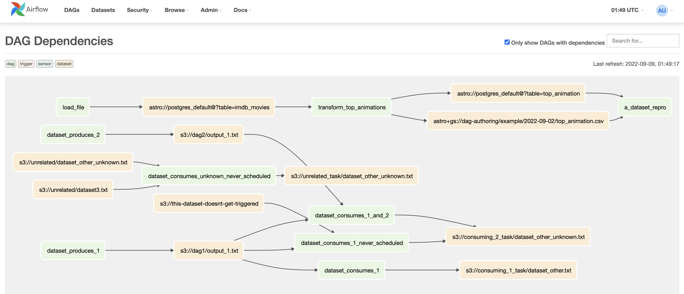

========
Concepts
========

.. _table:

Tables
------

Tables represent the location and, optionally, the column types of a SQL Database table. They are used in most Astro SDK tasks and decorators.

There are two types of tables:

#. **Persistent Table**

    These are tables that are of some importance to users and will we persist in a database even after a DAG run is finished and won't be deleted by :ref:`cleanup_operator`. Users can still drop them by using :ref:`drop_table_operator`. You can create these tables by passing in a ``name`` parameter while creating a ``astro.sql.table.Table`` object.

    .. literalinclude:: ../example_dags/example_amazon_s3_postgres_load_and_save.py
       :language: python
       :start-after: [START named_table_example]
       :end-before: [END named_table_example]

#. **Temporary Tables**

    It is a common pattern to create intermediate tables during a workflow that don't need to be persisted afterwards. To accomplish this, users can use Temporary Tables in conjunction with the :ref:`cleanup_operator` task.

    There are two approaches to create temporary tables:

    #. Explicit: instantiate a ``astro.sql.table.Table`` using the argument  `temp=True`
    #. Implicit: instantiate a ``astro.sql.table.Table`` without giving it a name, and without specifying the `temp` argument

        .. literalinclude:: ../example_dags/example_amazon_s3_postgres.py
           :language: python
           :start-after: [START temp_table_example]
           :end-before: [END temp_table_example]

Metadata
~~~~~~~~
Metadata is used to give additional information to access a SQL Table.
For example, a user can detail the Snowflake schema and database for a table, whereas a BigQuery user can specify the namespace and dataset. Although these parameters can change name depending on the database, we have normalised the :class:`~astro.sql.table.Metadata` class to name their schema and database.

.. literalinclude:: ../example_dags/example_amazon_s3_snowflake_transform.py
   :language: python
   :start-after: [START metadata_example_snowflake]
   :end-before: [END metadata_example_snowflake]

.. _load_file_working:

How load_file Works
-------------------
.. to edit figure below refer - https://lucid.app/lucidchart/d52867aa-62b4-4aa8-a6ff-7abd3ffc8ece/edit?viewport_loc=-200%2C-117%2C2597%2C1294%2C0_0&invitationId=inv_b313e94c-eda2-4ece-a801-396764d12b46#
.. figure:: /images/defaultPath.png

When we load a file located in cloud storage to a cloud database, internally the steps involved are:

Steps:

#. Get the file data in chunks from file storage to the worker node.
#. Send data to the cloud database from the worker node.

This is the default way of loading data into a table. There are performance bottlenecks because of limitations of memory, processing power, and internet bandwidth of worker node.

Improving bottlenecks by using native transfer
~~~~~~~~~~~~~~~~~~~~~~~~~~~~~~~~~~~~~~~~~~~~~~~
.. to edit figure below refer - https://lucid.app/lucidchart/d52867aa-62b4-4aa8-a6ff-7abd3ffc8ece/edit?viewport_loc=-200%2C-117%2C2597%2C1294%2C0_0&invitationId=inv_b313e94c-eda2-4ece-a801-396764d12b46#
.. figure:: /images/nativePath.png

Some of the cloud databases like Bigquery and Snowflake support native transfer (complete list of supported native transfers :ref:`supported_native_path`) to ingest data from cloud storage directly. Using this we can ingest data much quicker and without any involvement of the worker node.

Steps:

#. Request destination database to ingest data from the file source.
#. Database request file source for data.

This is a faster way for datasets of larger size as there is only one network call involved and usually the bandwidth between vendors is high. Also, there is no requirement for memory/processing power of the worker node, since data never gets on the node. There is significant performance improvement due to native transfers as evident from `benchmarking results <https://github.com/astronomer/astro-sdk/blob/main/tests/benchmark/results.md>`_.

**Note** - By default the native transfer is enabled and will be used if the source and destination support it, this behavior can be altered by the ``use_native_support`` param.

.. _templating:

Templating
----------
Templating is a powerful concept in Airflow to pass dynamic information into task instances at runtime. Templating in Airflow works exactly the same as templating with Jinja in Python: define your to-be-evaluated code between double curly braces, and the expression will be evaluated at runtime.

The parameter list passed to the decorated function is also added to the context which is used to render template. For example:

.. literalinclude:: ../example_dags/example_transform.py
       :language: python
       :start-after: [START transform_example_3]
       :end-before: [END transform_example_3]

More details can be found at `airflow templates reference <https://airflow.apache.org/docs/apache-airflow/stable/templates-ref.html>`_

.. _file_pattern:

Patterns in File path
~~~~~~~~~~~~~~~~~~~~~

We also resolve the patterns in file path based on the :ref:`file_location`

#. **Local** - Resolves ``File.path`` using the glob standard library (https://docs.python.org/3/library/glob.html)
#. **S3** - Resolves ``File.path`` using AWS S3 prefix rules (https://docs.aws.amazon.com/AmazonS3/latest/userguide/using-prefixes.html)
#. **GCS** - Resolves ``File.path`` using Google Cloud Storage (GCS) wildcard rules (https://cloud.google.com/storage/docs/gsutil/addlhelp/WildcardNames)

.. _dataset:

Datasets
--------

An Airflow dataset is a stand-in for a logical grouping of data. Datasets may be updated by upstream "producer" tasks, and dataset updates contribute to scheduling downstream "consumer" DAGs.

A dataset is defined by a Uniform Resource Identifier (URI):

.. code-block:: python

    from airflow import Dataset

    example_dataset = Dataset("s3://dataset-bucket/example.csv")

Astro SDK uses following URIs as datasets across its operators.

#. :ref:`table` as a Dataset

    .. literalinclude:: ../example_dags/example_datasets.py
           :language: python
           :start-after: [START dataset_table]
           :end-before: [END dataset_table]

#. File as a Dataset

    .. literalinclude:: ../example_dags/example_datasets.py
           :language: python
           :start-after: [START dataset_file]
           :end-before: [END dataset_file]

Following examples show how to produce and use datasets for scheduling.

#. **Dataset Producer** - Produces output dataset ``imdb_movies_table`` as a Table.

    .. literalinclude:: ../example_dags/example_datasets.py
           :language: python
           :start-after: [START dataset_producer]
           :end-before: [END dataset_producer]

#. **Dataset Consumer** - DAG gets scheduled post input dataset Table ``imdb_movies_table`` is produced by the upstream DAG above.

    .. literalinclude:: ../example_dags/example_datasets.py
           :language: python
           :start-after: [START dataset_consumer]
           :end-before: [END dataset_consumer]

Python SDK uses default datasets for its operators and the details of the default datasets generated and used by them can be found in the respective :ref:`operators` document.
However, you can override them by passing the keyword arguments ``inlets`` and ``outlets`` to the operators.

You can disable the usage of these default datasets and hence disable data-aware scheduling of DAGs by updating Airflow's configuration in ``airflow.cfg``

.. code:: shell

   [astro_sdk]
   auto_add_inlets_outlets = "false"

or by setting the below environment variable in your deployment

.. code:: python

   AIRFLOW__ASTRO_SDK__AUTO_ADD_INLETS_OUTLETS = "false"

Following is a view of dag dependencies on datasets

More details can be found at `airflow datasets concept <https://airflow.apache.org/docs/apache-airflow/stable/concepts/datasets.html>`_

.. Note::
    The concept of Datasets in astro-sdk is supported only from the **1.1.0** release ( and requires Airflow version **2.4.0** and above).
