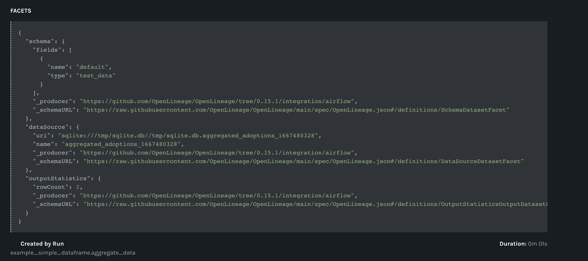

.. _openlineage:

============
OpenLineage
============

OpenLineage is an open framework for data lineage collection and analysis. At its core is an extensible
specification that systems can use to interoperate with lineage metadata. Astro SDK operators needs a
wrapper around openlineage extractors to show the events on the UI.

.. seealso::

    `Enabling OpenLineage in Apache Airflow <https://openlineage.io/integration/apache-airflow/>`__

Configure the Openlineage
==========================

We'll need to specify where we want Airflow to send OpenLineage events. openlineage-airflow will use the
``OPENLINEAGE_URL`` environment variable to send OpenLineage events to Marquez. Optionally, we can also
specify a namespace where the lineage events will be stored using the ``OPENLINEAGE_NAMESPACE`` environment variable.

For example, to send OpenLineage events to a local instance of Marquez with the dev namespace, use:

.. code-block:: ini

    AIRFLOW__LINEAGE__BACKEND=openlineage.lineage_backend.OpenLineageBackend
    OPENLINEAGE_URL=http://localhost:5000
    OPENLINEAGE_NAMESPACE="dev"

If you want to use the Astro SDK extractors to get openlineage events, then set the environment variable

.. code-block:: ini

    OPENLINEAGE_EXTRACTORS="astro.lineage.extractor.PythonSDKExtractor"

Example DAG and Lineage events
===============================

.. code-block:: python

    import os
    import pandas as pd
    import time

    from datetime import datetime, timedelta

    from airflow.decorators import dag
    from astro.table import Metadata, Table

    variable_list = [["a", "b", "c"], ["AA", "BB", "CC"]]
    dfList = pd.DataFrame(variable_list, columns=["COL_A", "COL_B", "COL_C"])

    @aql.dataframe(columns_names_capitalization="original")
    def aggregate_data(df: pd.DataFrame):
        new_df = df
        new_df.columns = new_df.columns.str.lower()
        return new_df

    @dag(
        start_date=datetime(2021, 1, 1),
        max_active_runs=1,
        schedule_interval="@daily",
        default_args={
            "email_on_failure": False,
            "retries": 0,
            "retry_delay": timedelta(minutes=5),
        },
        catchup=False,
    )
    def example_simple_dataframe():
        aggregate_data(
            dfList,
            output_table=Table(
                name="aggregated_adoptions_" + str(int(time.time())),
                metadata=Metadata(
                    schema=os.environ["SCHEMA"], database=os.environ["DATABASE"]
                ),
                conn_id="sqlite_default",
            ),
        )

Sample Openlineage events shown on Marquez UI

