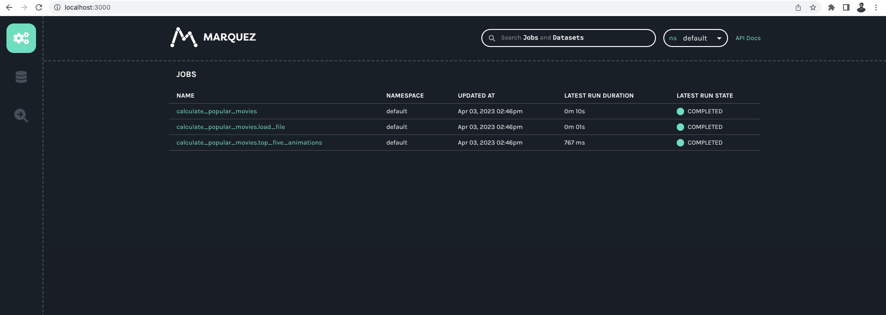
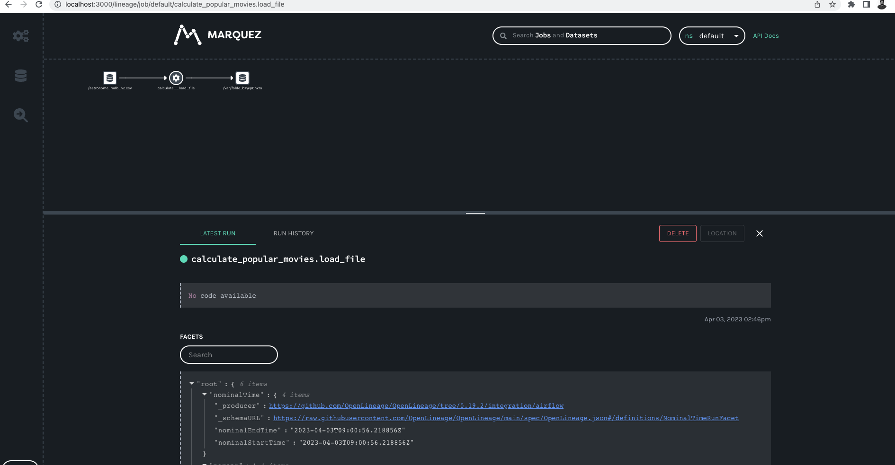

.. _openlineage:

=========================
Open Lineage Integration
=========================

OpenLineage is an open-source framework for data lineage collection and analysis. At its core is an extensible
specification that systems can use to interoperate with lineage metadata.

.. seealso::

    `Enabling OpenLineage in Apache Airflow <https://openlineage.io/docs/integrations/airflow/usage>`__

Configure the OpenLineage and Astro Python SDK Integration
===========================================================

We'll need to specify where we want Astro Python SDK operators to send OpenLineage events. openlineage-airflow will use the
``OPENLINEAGE_URL`` environment variable to send OpenLineage events to Marquez. Optionally, we can also
specify a namespace where the lineage events will be stored using the ``OPENLINEAGE_NAMESPACE`` environment variable.

A user may choose to send or not, the source code to the OpenLineage then user can specify an environment variable
``OPENLINEAGE_AIRFLOW_DISABLE_SOURCE_CODE`` set with either ``True`` or ``False``. By default it will be set to ``True``.

.. note::
    Disclaimer: Users need to trigger the DAG from the webserver. ``airflow dags tests`` would not work with open lineage.

For example, to send OpenLineage events to a local instance of Marquez with the dev namespace, use:

.. code-block:: ini

    AIRFLOW__LINEAGE__BACKEND=openlineage.lineage_backend.OpenLineageBackend
    OPENLINEAGE_URL=http://localhost:3000
    OPENLINEAGE_NAMESPACE="default"
    AIRFLOW__ASTRO_SDK__OPENLINEAGE_EMIT_TEMP_TABLE_EVENT=False

When you run the example DAG given below, by setting the environment variables described above,

.. literalinclude:: ../../example_dags/calculate_popular_movies.py
       :language: python
       :start-after: [START howto_example_dag_calculate_popular_movies]
       :end-before: [END howto_example_dag_calculate_popular_movies]

Then you would see the Openlineage facets on Marquez/OpenLineage UI under ``default`` namespace

Lineage from the task can be viewed by clicking on ``calculate_popular_movies.load_file``

